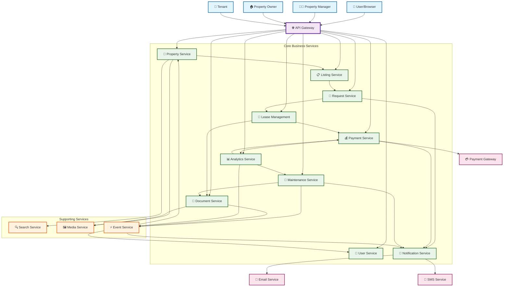
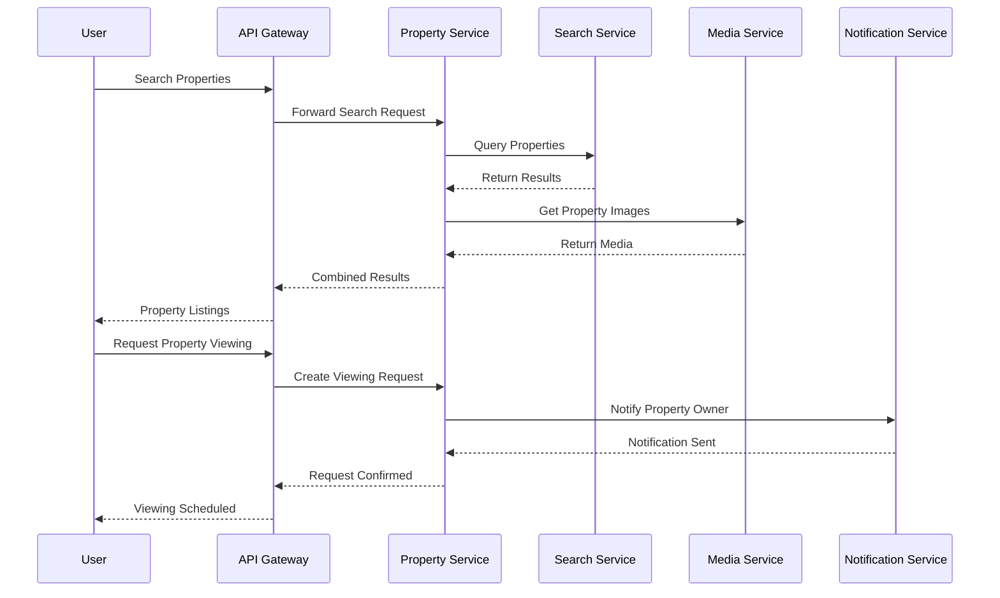
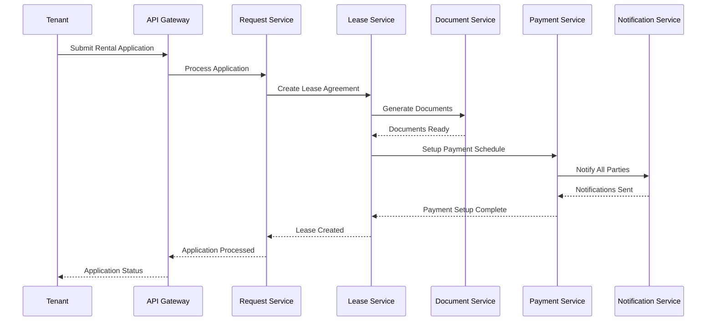
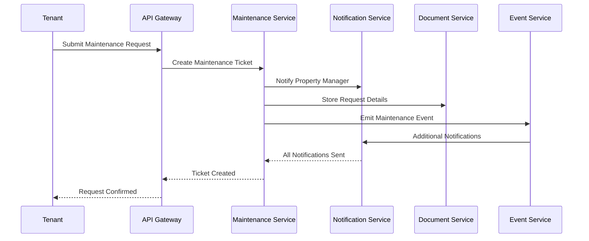
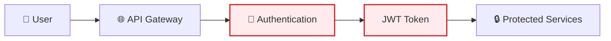

# Property Management System Service Workflow

## High-Level Architecture Diagram

## Detailed Service Workflows

### 1. Property Search & Viewing Flow

### 2. Rental Application & Payment Flow

### 3. Maintenance Request Flow

## Service Responsibilities & Data Flow

### Core Services

| Service                  | Primary Responsibility               | Key Interactions                         |
| ------------------------ | ------------------------------------ | ---------------------------------------- |
| **User Service**         | User authentication, profiles, roles | All services for user validation         |
| **Property Service**     | Property data, details, status       | Search, Media, Listing services          |
| **Listing Service**      | Property listings, availability      | Property, Request, Notification services |
| **Request Service**      | Viewing requests, applications       | Listing, Lease, Notification services    |
| **Payment Service**      | Financial transactions, billing      | Lease, Notification, Analytics services  |
| **Lease Management**     | Agreements, terms, renewals          | Document, Payment, Notification services |
| **Maintenance Service**  | Maintenance requests, scheduling     | Notification, Document, Event services   |
| **Notification Service** | System notifications, alerts         | All services for communication           |
| **Document Service**     | Document storage, management         | Media, Event services                    |
| **Analytics Service**    | Reporting, metrics, insights         | Payment, Maintenance, Event services     |

### Supporting Services

| Service            | Primary Responsibility      | Key Interactions            |
| ------------------ | --------------------------- | --------------------------- |
| **Search Service** | Property search, filtering  | Property Service            |
| **Media Service**  | Image/video storage         | Property, Document services |
| **Event Service**  | Inter-service communication | All services for events     |

### External Integrations

| Integration         | Purpose             | Connected Services   |
| ------------------- | ------------------- | -------------------- |
| **Payment Gateway** | Payment processing  | Payment Service      |
| **Email Service**   | Email notifications | Notification Service |
| **SMS Service**     | SMS notifications   | Notification Service |

## Data Flow Patterns

### 1. **Synchronous Communication**

-   Direct API calls between services
-   Used for immediate responses
-   Example: Property Service → Search Service

### 2. **Asynchronous Communication**

-   Event-driven communication via Event Service
-   Used for non-blocking operations
-   Example: Payment completion → Notification Service

### 3. **Data Consistency**

-   Each service maintains its own database
-   Event sourcing for data synchronization
-   Saga pattern for distributed transactions

### 4. **Error Handling**

-   Circuit breakers for service resilience
-   Retry mechanisms with exponential backoff
-   Dead letter queues for failed events

## Security & Authentication

-   **API Gateway**: Central authentication point
-   **JWT Tokens**: Stateless authentication
-   **Role-Based Access**: Different permissions per user type
-   **API Security**: Rate limiting, input validation
-   **Data Encryption**: Sensitive data encryption at rest and in transit
